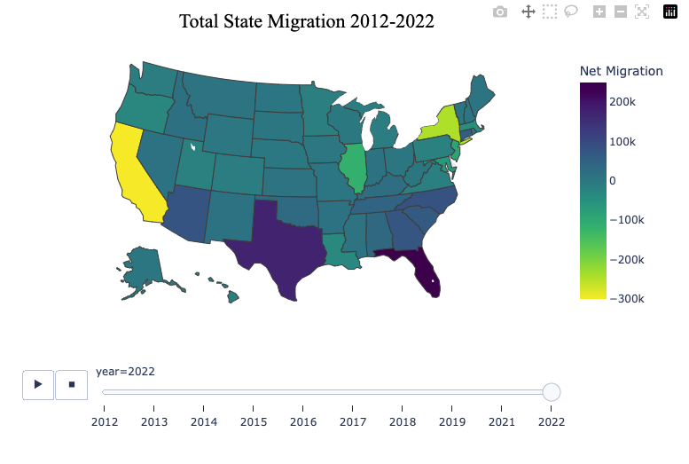

# Analysis of CPI, Migration and Home Prices

## Objectives:

The objectives of this project are to:

1. Read in, clean, and organize US CPI, HPI, Migration, and Median House Price data
2. Quantify each variable between 2012 and 2022
3. Identify trends within and between variables
4. Identify correlation between variables within and between certain states

## Data Sources:

The datasets for this project were pulled from a variety of state, federal, and corporate websites. They are the following:

#### CPI
* [Department of Finance](https://dof.ca.gov/forecasting/economics/economic-indicators/inflation/)
* [Texas.gov](https://data.texas.gov/dataset/Key-Economic-Indicators/karz-jr5v/about_data)

#### HPI, Median Home Prices, and Geographic Data
* [Federal Housing Finance Agency](https://www.fhfa.gov/DataTools/Downloads/Pages/House-Price-Index-Datasets.aspx)
* [Zillow](https://www.zillow.com/research/data/)
* [Simplemaps.com](https://simplemaps.com/data/us-cities)

#### Migration
* [Census.gov](https://www.census.gov/data/tables/time-series/demo/geographic-mobility/state-to-state-migration.html)

Most of the subject entities provided the datasets in `.xls` or `.csv` format. A portion of the data prep and cleaning occured in Excel utilizing the `=TOCOL()` and `transpose` functions to reorganize the data.

### Importing and Cleaning 

All datasets were read into Python Pandas dataframes using the `read_csv` function and cleaned using functions such as `.strip()`, among others. 
Unneeded colums were dropped using `.drop()` and `.isin()` was used to filter unneeded data such as years and quarters outside of the study from rows. Nulls were dropped with `.dropna()`.

## Migration

#### Necessary Libraries and Dependencies

```python
from pathlib import Path
import pandas as pd
import hvplot.pandas
import plotly.express as px
import numpy as np
import seaborn as sns
%matplotlib inline
```
#### Goal

The goal of this section is to identify and quantify migration trends between states over the ten year period. At the end of this analysis we will know precisely each state's net migration for each year.

#### Organizating the Data

Ten csv files are read in and concatenated to create a dataframe containing all migration totals for each state between 2012 and 2022. Unfortunately, 2020 data is not included. Census.gov claims the migration data for this year is not available due to the pandemic at that time.

Next, the data is cleaned and organized. Since all ten csv files are from the same source and have the same format, this requires only dropping null values and changing the state names for the 'state' and 'prev_state' columns to the state abbreviation. This step is important for plotting our data because the library 'plotly.express' requires state names to be listed as state abbreviations in order to populate a national 'choropleth' map.

#### Analysis

Since the objective of this section is to quantify migration trends between states over the given time period, we next group our dataframe by 'state' and 'year', sum the 'migration' column and assign the values to a new variable. This will give us the gross migration for each year and each state. We then repeat this step grouping by 'prev_state' and 'year' to give us the gross emmigration for each state over the time period.

We now have two variables, one containing the gross immigration and one containing the gross emmigration. Concatenating these into a new dataframe gives us the total immigration and emmigration for each state and each year. We now clean this new dataframe by dropping the redundant 'year' column and unnecessary 'prev_state' column.

Next, finding the total net migration for each state and each year is as simple as creating a new column in our dataframe, 'net_migration' that is equal to 'total_immigration' - 'total_emigration'.

#### Plotting

The 'choropleth' function of the plotly.express library will give us an overlay of our data on a United States map as long as we assign our variables correctly.

```python
fig = px.choropleth(mm_totals,
    locations='state',
    locationmode="USA-states",
    scope="usa",
    color='net_migration', # display 'net_migration' between states 
    color_continuous_scale="Viridis_r",
    width = 800,
    height = 500,
    labels = {'net_migration':'Net Migration'},
    animation_frame='year', # animates the change in net migration between years
    range_color = [-300000,250000] # fixes the color range of 'net_migration' for uniform display
)
```
Here, 'locations=state' tells the function to plot the values from our 'state' column onto a map of the United States, as assigned by `scope=usa`. Next, assigning `net_migration` to `color` will show us the change in net migration for each state by color variation. Fixing the `range_color` to a set range serves to highlight the change in `net_migration` over all ten years, rather than one year at a time. Lastly, by setting `animation_frame` to `year` we will achieve an animated graph showing how migration changes between each year. Here is a snapshot of 2022:



The graph generated with plotly.express tells a compelling story of how drastic inter-state migration trends have become since 2020. These numerical findings for each state will be used again when mapping the correlation between migration and our other variables.


## Correlation

#### Necessary Libraries

```python
from pathlib import Path
import pandas as pd
import plotly.express as px
import numpy as np
import hvplot.pandas
import seaborn as sns
```

#### Goal

The goal of this section of the project is to identify if the trends we've uncovered within each state for each variable are correlated to eachother. 

#### Organizating the Data

The first portion of this notebook is copied from the other notebooks for each variable, CPI, HPI and Migration. This is because the cleaning process is the same and we want to use the same values we used for the final analysis of the other sections.

The new code section of this notebook is labeled and begins with concatenating all inflation dataframes. Next, we sort the migration data for each state included in our analysis, CA, TX, and FL and assign them into seperate dataframes for each state. We then drop all other columns except for net migration. Lastly, we do the same for each state's home appreciation values from the HPI section and concatenate all dataframes for all states and variables together. Renaming each column is important here so we are able to interpret our correlation map later.

#### Analysis

We then run the `.corr` function on our combined dataframe and plot the correlation using seaborn. Here is the outcome:

See images folder


Since this master heatmap looks busy and contains variables that don't necessarily need to be correlated, new heatmaps for each state are warranted. This is accomplished by assigning all state variables to new respective  state dataframes and rerunning the correlation and heatmap steps. Here is the plot for Florida variables:


See images folder

#### Outcome

What we found is that CPI, HPI, and Migration are strongly correlated in Florida, reasonably correlated in Texas, and not correlated in California. This outcome is logical since California has seen home prices rise despite their significant negative net migration and alludes to a complex causality in California's real estate values. In comparison, since Texas and Florida have both seen a rise in population, inflation, and real estate values justifying their stronger correlations between state variables.


## Sources:

#### CPI
* [Department of Finance](https://dof.ca.gov/forecasting/economics/economic-indicators/inflation/)
