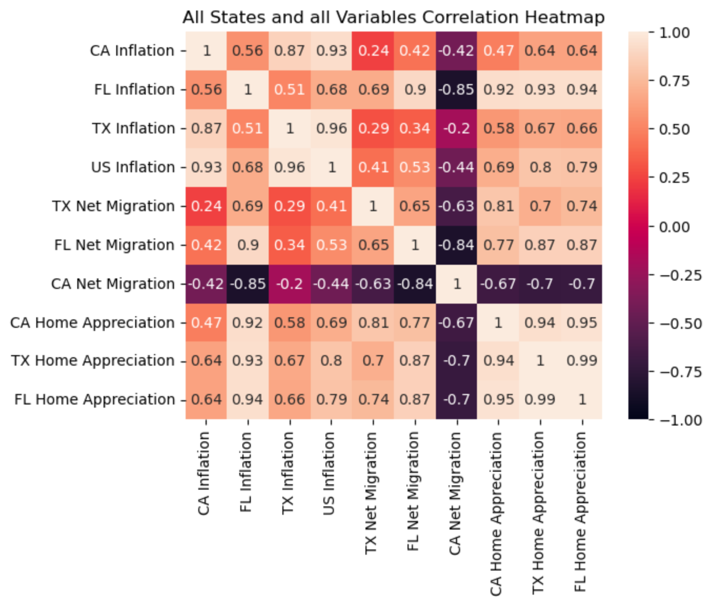
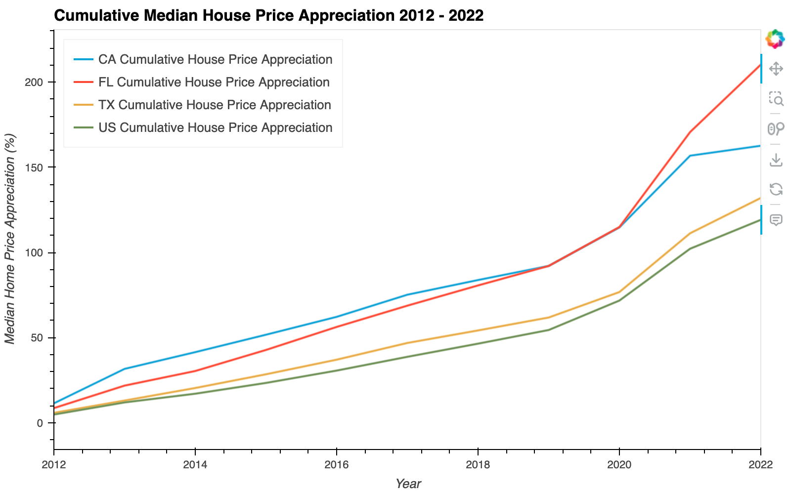
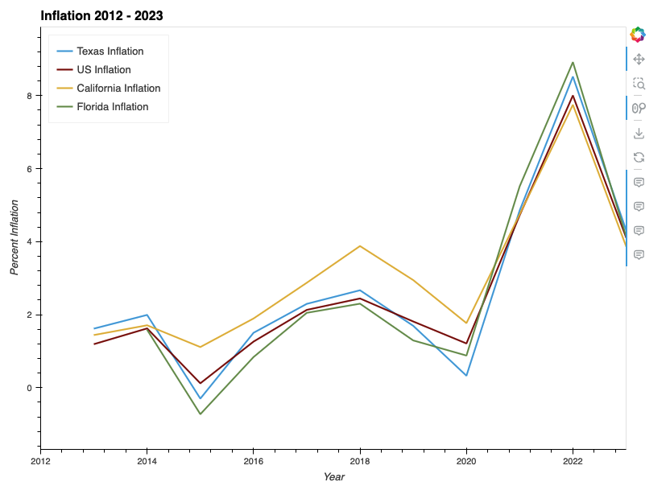
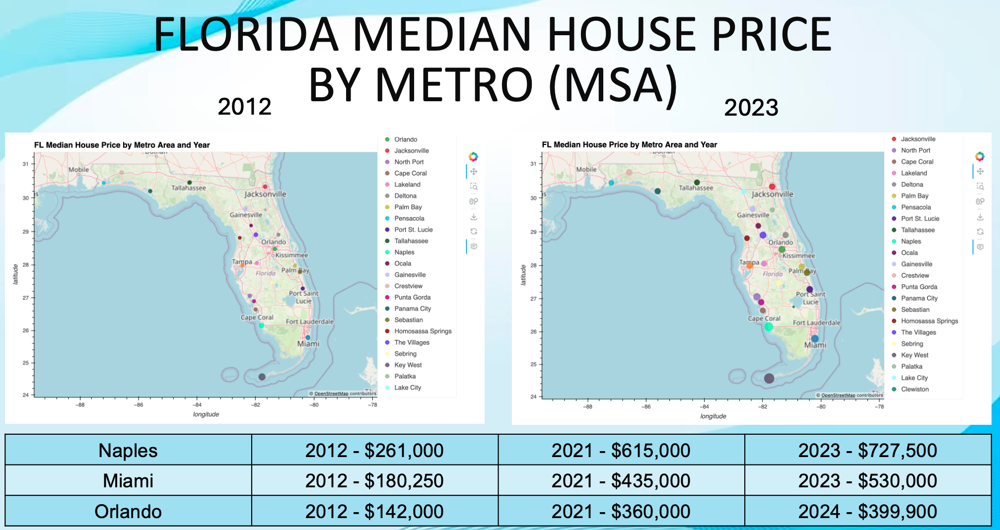
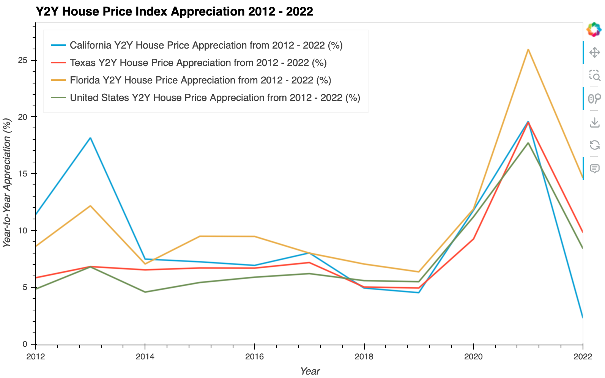

# Analysis of CPI, Migration and Home Prices

## Objectives:

The objectives of this project are to:

1. Read in, clean, and organize US CPI, HPI, Migration, and Median House Price data
2. Quantify each variable between 2012 and 2022
3. Identify trends within and between variables
4. Identify correlation between variables within and between certain states

## Data Sources:

The datasets for this project were pulled from a variety of state, federal, and corporate websites. They are the following:

#### CPI
* [Department of Finance](https://dof.ca.gov/forecasting/economics/economic-indicators/inflation/)
* [Texas.gov](https://data.texas.gov/dataset/Key-Economic-Indicators/karz-jr5v/about_data)

#### HPI, Median Home Prices, and Geographic Data
* [Federal Housing Finance Agency](https://www.fhfa.gov/DataTools/Downloads/Pages/House-Price-Index-Datasets.aspx)
* [Zillow](https://www.zillow.com/research/data/)
* [Simplemaps.com](https://simplemaps.com/data/us-cities)

#### Migration
* [Census.gov](https://www.census.gov/data/tables/time-series/demo/geographic-mobility/state-to-state-migration.html)

Most of the subject entities provided the datasets in `.xls` or `.csv` format. A portion of the data prep and cleaning occured in Excel utilizing the `=TOCOL()` and `transpose` functions to reorganize the data.

### Importing and Cleaning 

All datasets were read into Python Pandas dataframes using the `read_csv` function and cleaned using functions such as `.strip()`, among others. 
Unneeded colums were dropped using `.drop()` and `.isin()` was used to filter unneeded data such as years and quarters outside of the study from rows. Nulls were dropped with `.dropna()`.

The importing, cleaning, and analysis was conducted in four Jupyter Labs notebooks...

* [Consumer Price Index (CPI)](CPI.ipynb)
* [House Price Index (HPI) and Median House Price](HPI-MedianHP.ipynb)
* [Migration](Migration.ipynb)
* [Correlations](Correlations.ipynb)

...utilizing the following libraries and dependencies.

```python
from pathlib import Path
import pandas as pd
import hvplot.pandas
import plotly.express as px
import numpy as np
import seaborn as sns
%matplotlib inline
```
## Summary of Major Findings

### What is the impact of migration and inflation on housing prices?

We found a direct correlation between inflation, migration, and housing prices in Texas and Florida. As population and inflation rose, so did home values accordingly. In comparison, despite negative net migration over the past ten years, California home prices have still risen. We found that home prices were not correlated to inflation rates and home values but are likely part of a complex causality

As the heatmap shows, California is the outlier among otherwise correlated variables. 


Home prices in all three states continue to appreciate. Even in California despite its negative net migration. 



### Are certain states more impacted by migration and inflation than others? 

Based on our findings, all states were impacted by migration. Five states stood out as especially significant in terms of net migration. Those states with the greatest change in net migration were California, Florida, Texas, New York, and Illinois. We selected the top three for further study. We then looked at the inflation in the three states and observed that they were trending consistantly with the US national average inflation.

As the graph shows, the five most impacted states were Florida and Texas with the highest immigration, and California, New York, and Illinois with the highest emmigration. (listed in order of magnitude) 


All three states follow the national average as show below. 


### What are some common trends between these three factors over the last 10 years?

The most obvious trend that was identified between these three factors was a significant spike over the years of 2021 and 2022. Florida and Texas, with the largest incoming migration, also saw the highest increase and continuation of home appreciation rates. California with the largest net migration exodus experienced the most substantial fall in home price appreciation of the subject group, even outpacing the national average from 2021 to 2022.

This dynamic played out notably in Florida as demonstrated in the plot below. 


As noted in the line graph below, California's fall in home price appreciation was so substantial that it was the only state in our study to finish, in 2022, lower than it was ten years prior in 2012.


#### Outcome

What we found is that CPI, HPI, and Migration are strongly correlated in Florida, reasonably correlated in Texas, and not correlated in California. This outcome is logical since California has seen home prices rise despite their significant negative net migration and alludes to a complex causality in California's real estate values. In comparison, since Texas and Florida have both seen a rise in population, inflation, and real estate values justifying their stronger correlations between state variables.


## Sources:

#### CPI
* [Department of Finance](https://dof.ca.gov/forecasting/economics/economic-indicators/inflation/)
